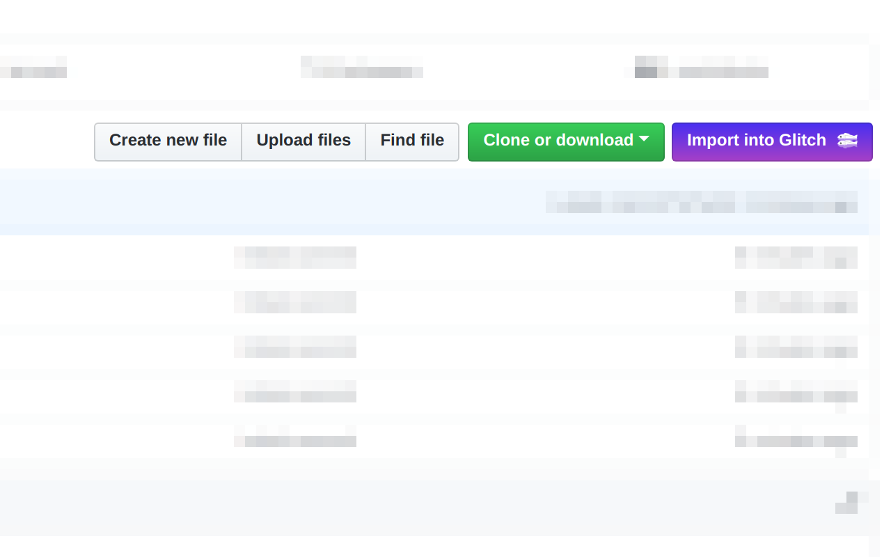

# github-glitch-button

Import from a public GitHub repo into Glitch

## install

can install it via the chrome web store
https://chrome.google.com/webstore/detail/github-glitch-button/ffkmmljfhjanmbgokllhenmnkgpipfek?hl=en-GB

## screenshot

